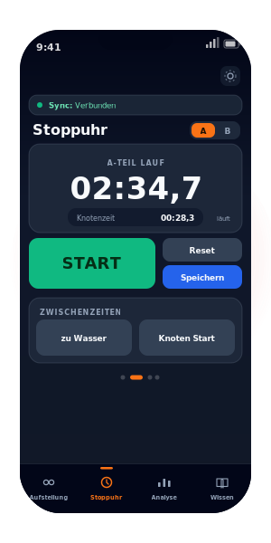

<div align="center">


# open-JF-Coach

**Training für die Jugendfeuerwehr digital meistern.**

Die mobile Trainings-App für Betreuer und Ausbilder der Jugendfeuerwehr —
für die Leistungsspange, den Bundeswettbewerb und den alltäglichen Dienst.

[](LICENSE)
[](#)
[](https://react.dev/)
[](https://vitejs.dev/)

[**🚀 App öffnen**](https://app.open-jf-coach.de/) &middot; [Features](#-features) &middot; [Wie es funktioniert](#-für-a-teil-b-teil-und-alles-dazwischen) &middot; [Loslegen](#-eigene-instanz-aufsetzen)

`Open Source` &middot; `Kostenlos` &middot; `Datenschutzfreundlich`

<br/>



</div>

---

## ✨ Features

Von der Aufstellung bis zur Nachbesprechung — open-JF-Coach begleitet euch durch jeden Trainingstag.

| | Feature | Beschreibung |
|---|---|---|
| 👥 | **Aufstellung & Rollen** | Mitglieder verwalten und für A-Teil sowie B-Teil die Positionen (GF, ATF, WTF …) gezielt planen und zuweisen. |
| ⏱️ | **Stoppuhr & Zeitmessung** | Exakte Timer für Übungsläufe, Knotentraining und Staffelstrecken — direkt auf dem Smartphone, auch offline. |
| 📊 | **Trainingsanalyse** | Automatisch gespeicherte Trainingseinheiten mit Zeitstempeln und Positionsmatrix für eine fundierte Nachbesprechung. |
| 📚 | **Wissensdatenbank** | Knoten, Fehlerpunkteregeln und vollständige Ablaufbeschreibungen für alle Trupps. |
| 📶 | **Offline-fähig (PWA)** | Als Progressive Web App installierbar — funktioniert auf dem Übungsplatz auch ohne Mobilfunknetz. |
| 🔄 | **Echtzeit-Sync** | Mehrere Betreuer sehen dasselbe Training live — Aufstellung und Zeiten werden sofort übertragen. |

---

## 🚒 Für A-Teil, B-Teil und alles dazwischen

open-JF-Coach kennt die Struktur der Jugendfeuerwehr-Wettbewerbe und spricht ihre Sprache.

### 🔴 A-Teil – Löschübung

| Position | Rolle | Aufgabe |
|---|---|---|
| **GF** | Gruppenführer | Befehle, Übersicht, Knotengestell |
| **Ma** | Maschinist | TS betreiben, Wasserversorgung |
| **Me** | Melder | Bereitstellung, Verteiler |
| **AT** | Angriffstrupp | 1. Rohr über die Leiterwand |
| **WT** | Wassertrupp | Wasserentnahme & 2. Rohr |
| **ST** | Schlauchtrupp | Material & 3. Rohr durch den Tunnel |

### 🟠 B-Teil – Staffellauf

Staffellauf für 9 Läufer mit Spezialaufgaben: Knotenstation (**L7**), Schlauchrollen (**L8**)
und regelkonforme Übergaben.

`L1` `L2` `L3` `L4` `L5` `L6` **`L7 Knoten`** **`L8 Schlauch`** `L9`

### 📖 Wissensdatenbank — Beispielinhalte

- **Knoten:** Mastwurf, Kreuzknoten, Zimmermannsschlag, Schotenstich
- **Fehlerpunkteregeln:** 5 FP Übertreten, 10 FP falscher Knoten …
- **Vollständige Ablaufbeschreibung** für alle 9 Trupppositionen

---

## 🔓 Open Source — transparent, sicher und selbst betrieben

open-JF-Coach ist frei und quelloffen. Keine versteckten Kosten, keine Datensammlung durch Dritte.

- **Open Source (AGPL-3.0)** — vollständiger Quellcode auf GitHub.
- **Eigene Daten, eigene Instanz** — jede Jugendfeuerwehr nutzt ihren eigenen kostenlosen Supabase-Datenspeicher.
- **Datenschutz (EU)** — Datenspeicher in der EU-Region (Frankfurt), ausgelegt für einen DSGVO-konformen Betrieb.
- **Ohne Technik startklar** — kein eigenes Hosting: App öffnen, mit Supabase verbinden, fertig.
- **Mitgestalten** — Issues melden, Features vorschlagen oder direkt Pull Requests öffnen.
- **Flexibel anpassen** — eigene Mitglieder, Rollen, Regeln und Wissenseinträge.

---

## 🛠️ Tech-Stack

- [React](https://react.dev/) + [Vite](https://vitejs.dev/)
- Backend wahlweise [Supabase](https://supabase.com/) (Postgres + Realtime) oder [Firebase](https://firebase.google.com/) (Firestore + Auth)
- [Workbox](https://developer.chrome.com/docs/workbox/) (PWA / Offline-Support)
- [lucide-react](https://lucide.dev/) (Icons)

---

## 🚀 Eigene Instanz aufsetzen

Es gibt **zwei Wege** — wähle den, der zu dir passt. Beide funktionieren parallel.

### 🟢 Einfacher Weg (ohne Technik) — Supabase

Für alle, die **nicht** selbst hosten oder bauen wollen. Du öffnest die fertige
App und verbindest sie über einen **Einrichtungs-Assistenten** mit deinem eigenen
kostenlosen Datenspeicher. Kein Terminal, kein Build, kein Hosting.

| Schritt | |
|---|---|
| **1. App im Browser öffnen** | Ruf [**app.open-jf-coach.de**](https://app.open-jf-coach.de/) auf — der Einrichtungs-Assistent erscheint automatisch. |
| **2. Supabase-Projekt anlegen** | Auf [supabase.com](https://supabase.com) ein kostenloses Projekt anlegen. Region **Central EU (Frankfurt)** wählen — wichtig für die DSGVO. |
| **3. Datenbank vorbereiten** | Den vom Assistenten angezeigten SQL-Block in den Supabase-Editor einfügen und `Run` klicken. |
| **4. Verbinden & loslegen** | Team-Name, Project-URL und Publishable Key eintragen — fertig. Weitere Betreuer holst du per **Einladungs-Link oder QR-Code** dazu. |

→ Ausführliche Anleitung: **[docs/supabase-setup.md](docs/supabase-setup.md)**

### 🔧 Profi-Weg — Firebase per Build

Für alle, die selbst bauen und hosten möchten. Die Firebase-Zugangsdaten werden
beim Build als Umgebungsvariablen hinterlegt.

[](https://app.netlify.com/start/deploy?repository=https://github.com/volltext/open-jf-coach)

1. **Firebase einrichten** → [FIREBASE_SETUP.md](FIREBASE_SETUP.md)
2. **App deployen** → [docs/deployment.md](docs/deployment.md)

> **Hinweis für Betreiber:** Sind die `VITE_FIREBASE_*`-Variablen beim Build gesetzt,
> nutzt die App automatisch Firebase und der Supabase-Assistent erscheint nicht.
> Für eine öffentliche „Selbst-verbinden"-Instanz die Firebase-Variablen einfach
> **nicht** setzen.

---

## 💻 Lokale Entwicklung

```bash
git clone https://github.com/volltext/open-jf-coach.git
cd open-jf-coach
npm install
cp .env.example .env   # Firebase-Credentials eintragen (siehe FIREBASE_SETUP.md)
npm run dev
```

Die App ist dann unter `http://localhost:5173` erreichbar.

---

## 🔒 Datenschutz (DSGVO)

Jede Jugendfeuerwehr, die diese App betreibt, ist selbst verantwortlich für die
Verarbeitung personenbezogener Daten ihrer Mitglieder gemäß DSGVO. Wir empfehlen,
das Backend in einer EU-Region zu betreiben (Firebase: `europe-west3` / Frankfurt,
Supabase: Central EU / Frankfurt).

## 🤝 Mitmachen

Beiträge sind willkommen! Bitte lies zuerst [CONTRIBUTING.md](CONTRIBUTING.md).

## 🛡️ Sicherheitslücken melden

Bitte lies [SECURITY.md](SECURITY.md).

## 📄 Lizenz

[AGPL-3.0](LICENSE) — Änderungen müssen ebenfalls open-source veröffentlicht werden.

<div align="center">

---

Open Source &middot; AGPL-3.0 &middot; Mit Herzblut für die Jugendfeuerwehr 🚒

</div>
